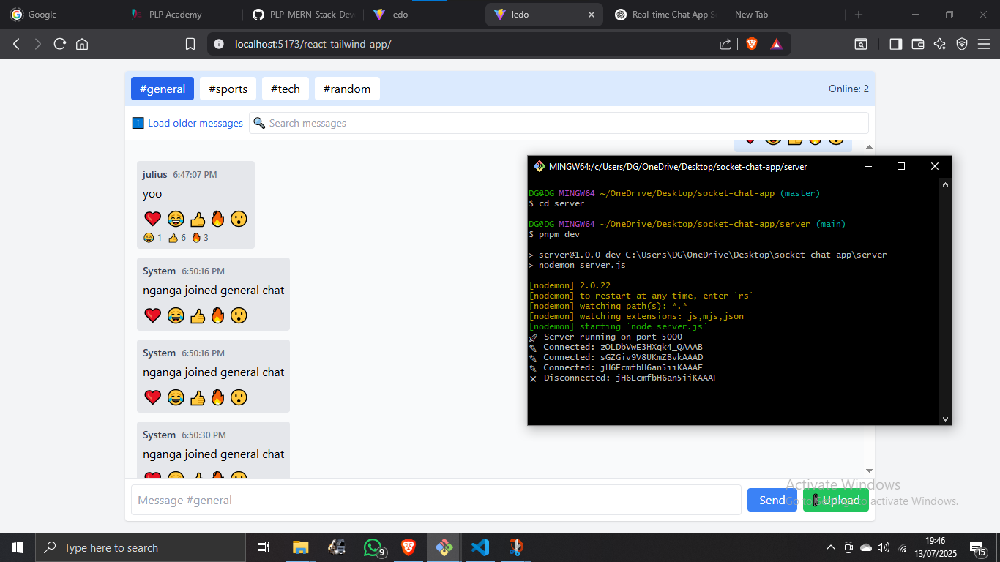

💬 Real-Time Chat App

A full-stack real-time chat application built with **React**, **Node.js**, **Express**, and **Socket.io**, using **pnpm** for fast and deterministic package management.

> 🌐 Live demo: _[https://client-smoky-psi.vercel.app/]

---

## 📸 Screenshots

### 🖥️ Chat Interface


### 📁 File Upload & Image Preview



> 🖼 Place your screenshots in a `screenshots/` folder in your repo.

---

## 🚀 Features

### Core Chat
- Real-time messaging with Socket.io
- Multiple chat rooms (channels)
- Online users per room
- Typing indicators
- Emoji reactions (❤️ 😂 👍 🔥 😮)

### Advanced Features
- File/image sharing with previews
- Read receipts via reaction updates
- Join/leave notifications
- Unread message counters
- Sound alerts and browser notifications
- Responsive design for mobile and desktop

### Performance & UX
- Infinite scrolling with message pagination
- Reconnection logic with state restore
- Fast filtering/search for messages

---

## 🛠️ Tech Stack

- **Client:** React + Tailwind CSS + Socket.io-client
- **Server:** Node.js + Express + Socket.io
- **Package Manager:** pnpm
- **Transport:** WebSockets
- **Notifications:** Web Notification API
- **Deployment:** Render / Vercel / Railway (options below)

---

## 📁 Project Structure

```bash
client/
├── src/
│   ├── components/
│   │   ├── ChatRoom.jsx
│   │   ├── UploadFile.jsx
│   │   └── MessageList.jsx
│   ├── App.jsx
│   └── socket.js
└── public/
    └── notification.mp3

server/
├── server.js
└── .env